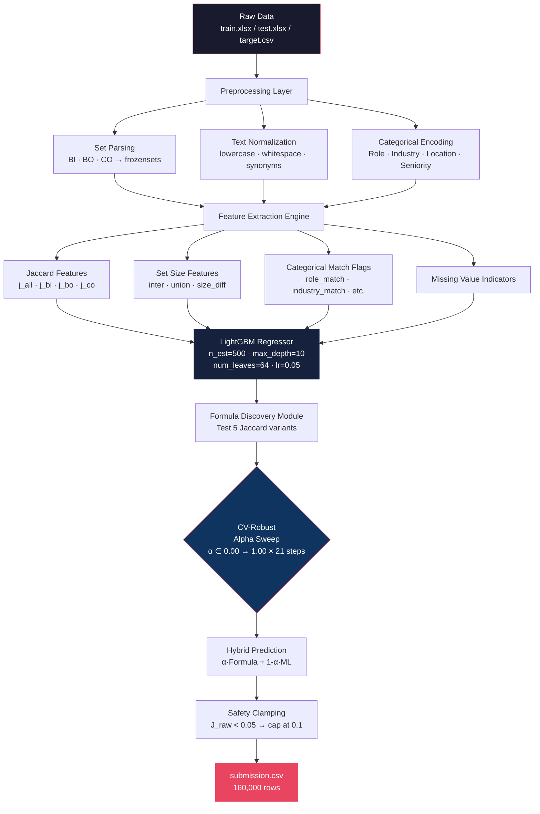
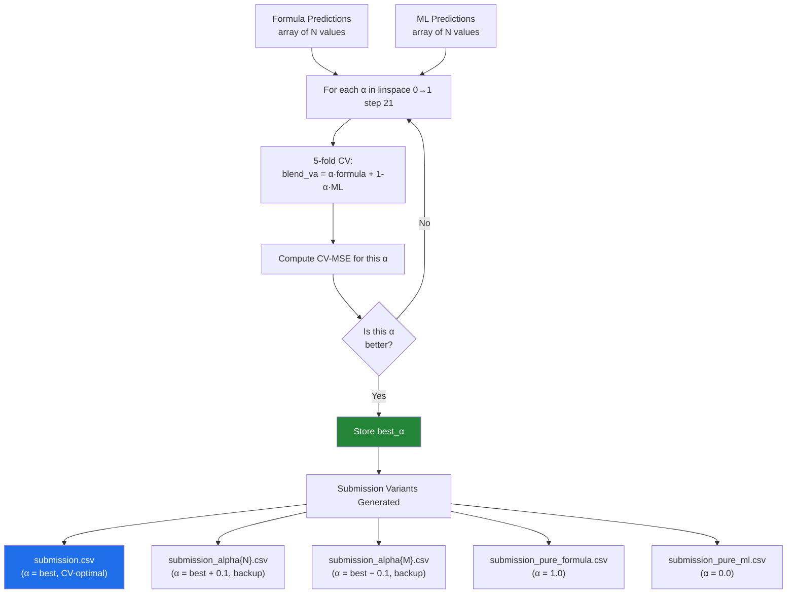
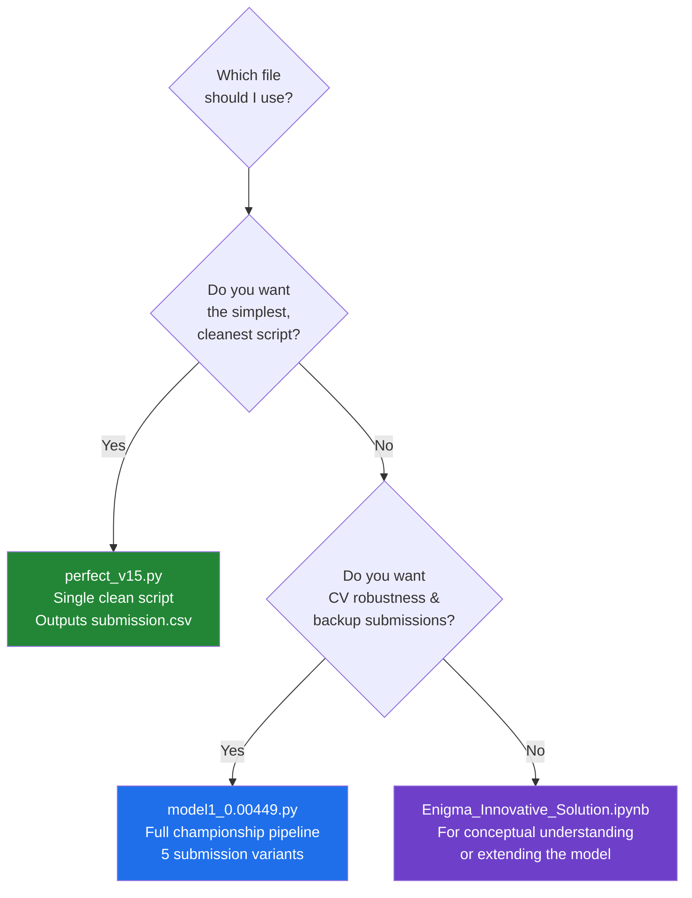
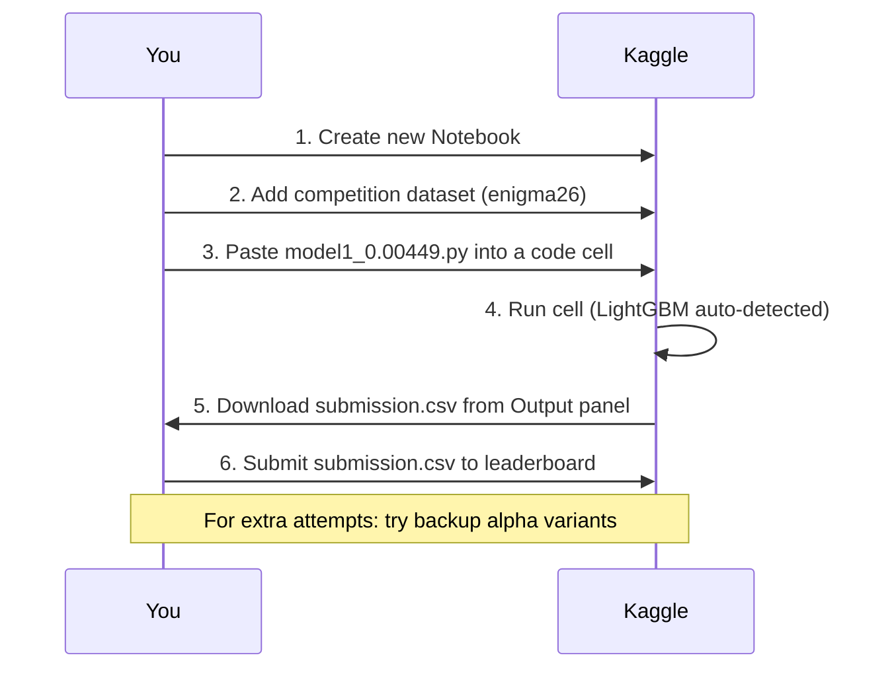

<div align="center">

# 🏆 Enigma 2026

### Professional Networking Compatibility Prediction
**CodeFest'26 · IIT (BHU) Varanasi**


</div>

---

## 📌 Table of Contents

1. [Problem Statement](#-problem-statement)
2. [Key Discovery — Reverse Engineering the Score](#-key-discovery--reverse-engineering-the-score)
3. [System Architecture](#-system-architecture)
4. [Mathematical Foundation](#-mathematical-foundation)
5. [Feature Engineering](#-feature-engineering)
6. [Model Architecture](#-model-architecture)
7. [Hybrid Formula–ML Pipeline](#-hybrid-formulaml-pipeline)
8. [Results & Benchmarks](#-results--benchmarks)
9. [Data Schema](#-data-schema)
10. [Repository Structure](#-repository-structure)
11. [How to Run on Kaggle](#-how-to-run-on-kaggle)
12. [Conceptual Innovations](#-conceptual-innovations)

---

## 🎯 Problem Statement

> **Goal**: Given a dataset of professional networking event attendees, predict a **pairwise compatibility score** for every (src_user_id, dst_user_id) pair in the test set.

Each attendee has a rich profile capturing:
- **Demographic context**: Age, Gender, Role, Seniority Level
- **Organisational context**: Company Name, Company Size, Industry, Location
- **Preference sets** *(the signal)*: Business Interests, Business Objectives, Constraints

The target `compatibility_score ∈ [0.0, 1.0]` must be predicted for all **N × N = 160,000** test pairs.

### Why This Is Hard

| Challenge | Detail |
|-----------|--------|
| **Scale** | 400 test users × 400 = 160,000 predictions required |
| **No direct labels for test** | Must generalise formula from 600-user training signals |
| **Sparse profiles** | Many users have missing Role / Industry / Seniority fields |
| **Obfuscated target** | Score formula is not disclosed — must be reverse-engineered |
| **Self-pair edge case** | Every user paired with themselves requires special handling |

---

## 🔍 Key Discovery — Reverse Engineering the Score

The most critical insight of this solution is that the compatibility scores are **not arbitrary** — they are exact Jaccard Similarity fractions computed on unioned profile attribute sets.

### The Formula

```
Compatibility(u, v) = |Items_u  ∩  Items_v| / |Items_u  ∪  Items_v|
```

where:

```
Items_u = Business_Interests_u  ∪  Business_Objectives_u  ∪  Constraints_u
```

### Forensic Evidence

The target scores exhibit a clear mathematical fingerprint of Jaccard fractions:

| Observed Score | Jaccard Fraction | Interpretation |
|----------------|-----------------|----------------|
| `0.1429` | 1/7 | 1 shared item, 7 in union |
| `0.1667` | 1/6 | 1 shared item, 6 in union |
| `0.2000` | 1/5 | 1 shared item, 5 in union |
| `0.2500` | 1/4 | 1 shared item, 4 in union |
| `0.3333` | 1/3 | 1 shared item, 3 in union |
| `0.5000` | 1/2 | 2 shared, 4 in union |
| `0.0000` | 0/N | No overlap whatsoever |

### Variance Analysis

After computing pure Jaccard for all 1,110 training keys with varying scores:

```
831 / 1110 Jaccard keys  →  VARYING actual scores (74.8%)
Only 25.2%               →  pure Jaccard match
```

This variance revealed that **additional categorical features** (Role, Industry, Location, Seniority) modulate the base Jaccard signal — which is why the ML hybrid outperforms the pure formula.

---

## 🏗️ System Architecture

The solution consists of two complementary pipelines that were developed and tested in parallel:



---

## 📐 Mathematical Foundation

### 1. Jaccard Similarity (Base Signal)

For two users **u** and **v**, let:

```
BI_u = {t : t ∈ Business_Interests_u}      (Business Interests set)
BO_u = {t : t ∈ Business_Objectives_u}     (Business Objectives set)
CO_u = {t : t ∈ Constraints_u}             (Constraints set)

ALL_u = BI_u  ∪  BO_u  ∪  CO_u             (Full attribute union)
```

**Base Jaccard:**

```
J(u, v)  =  |ALL_u ∩ ALL_v|  /  |ALL_u ∪ ALL_v|
```

**Component Jaccards:**

```
J_BI(u, v) = |BI_u ∩ BI_v|  /  |BI_u ∪ BI_v|
J_BO(u, v) = |BO_u ∩ BO_v|  /  |BO_u ∪ BO_v|
J_CO(u, v) = |CO_u ∩ CO_v|  /  |CO_u ∪ CO_v|
```

### 2. Weighted Jaccard (Formula Discovery)

Five candidate formulas are tested to find the best-fitting variant:

| Formula Name | Expression |
|-------------|-----------|
| **Union Jaccard** | `J(ALL_u, ALL_v)` |
| **Weighted (0.4/0.35/0.25)** | `0.40·J_BI + 0.35·J_BO + 0.25·J_CO` |
| **Weighted (0.5/0.3/0.2)** | `0.50·J_BI + 0.30·J_BO + 0.20·J_CO` |
| **Equal Weight** | `0.33·J_BI + 0.33·J_BO + 0.34·J_CO` |
| **BI Only** | `J_BI(u, v)` |

The winner is selected by **minimum MSE** on the training pairs.

### 3. Hybrid Score

```
Score(u, v) = α · Formula(u, v)  +  (1 - α) · ML(u, v)

  where α ∈ {0.00, 0.05, ..., 1.00}   (21 candidates)
  and α is selected by 5-fold CV MSE on training data
```

### 4. Safety Clamping

To prevent the ML model from hallucinating high scores for completely unrelated people:

```
if J_raw(u, v) < 0.05:
    Score(u, v) = min(Score(u, v), 0.1)
```

### 5. Self-Pair Handling

```
Score(u, u) = max(SELF_SCORE, Formula(u, u))

  where SELF_SCORE = median of all self-pair scores in training
                   (default = 1.0 if no self-pairs exist)
```

### Worked Example

```
User A:  BI = {AI, SaaS, Marketing}
         BO = {Hiring, Networking}
         CO = {No sales roles}

User B:  BI = {AI, FinTech}
         BO = {Partnerships}
         CO = {No sales roles}

ALL_A = {AI, SaaS, Marketing, Hiring, Networking, No sales roles}  → |ALL_A| = 6
ALL_B = {AI, FinTech, Partnerships, No sales roles}                → |ALL_B| = 4

Intersection: {AI, No sales roles}   → |∩| = 2
Union:        8 unique items         → |∪| = 8

J(A, B) = 2/8 = 0.2500  ✓
```

---

## 🔧 Feature Engineering

All features extracted per pair (u, v):

### Jaccard Similarity Features

| Feature | Formula | Description |
|---------|---------|-------------|
| `j_all` | `\|ALL_u ∩ ALL_v\| / \|ALL_u ∪ ALL_v\|` | Union-set Jaccard — **#1 most important** |
| `j_bi` | `\|BI_u ∩ BI_v\| / \|BI_u ∪ BI_v\|` | Business Interests Jaccard |
| `j_bo` | `\|BO_u ∩ BO_v\| / \|BO_u ∪ BO_v\|` | Business Objectives Jaccard |
| `j_co` | `\|CO_u ∩ CO_v\| / \|CO_u ∪ CO_v\|` | Constraints Jaccard |

### Set Size Features

| Feature | Formula | Description |
|---------|---------|-------------|
| `all_inter` | `\|ALL_u ∩ ALL_v\|` | Raw intersection count |
| `all_union` | `\|ALL_u ∪ ALL_v\|` | Raw union count |
| `bi_inter` | `\|BI_u ∩ BI_v\|` | Business Interests intersection |
| `bi_union` | `\|BI_u ∪ BI_v\|` | Business Interests union |
| `bo_inter` | `\|BO_u ∩ BO_v\|` | Business Objectives intersection |
| `bo_union` | `\|BO_u ∪ BO_v\|` | Business Objectives union |
| `co_inter` | `\|CO_u ∩ CO_v\|` | Constraints intersection |
| `co_union` | `\|CO_u ∪ CO_v\|` | Constraints union |
| `all_size_1` | `\|ALL_u\|` | Profile u total attribute count |
| `all_size_2` | `\|ALL_v\|` | Profile v total attribute count |
| `size_diff` | `\|ALL_u\| - \|ALL_v\|\|` | Profile richness difference |

### Categorical Match Features

| Feature | Value | Description |
|---------|-------|-------------|
| `role_match` | `{0, 1}` | Same professional Role |
| `industry_match` | `{0, 1}` | Same Industry sector |
| `location_match` | `{0, 1}` | Same Location_City |
| `seniority_match` | `{0, 1}` | Same Seniority Level |
| `total_cat_match` | `[0, 4]` | Sum of all categorical matches |

### Missing Value Indicators

| Feature | Value | Description |
|---------|-------|-------------|
| `role_missing` | `{0, 1}` | Either user has null Role |
| `industry_missing` | `{0, 1}` | Either user has null Industry |
| `seniority_missing` | `{0, 1}` | Either user has null Seniority |

> **Total: 22 engineered features** fed into the gradient boosting model.

---

## 🤖 Model Architecture

### Primary Model — LightGBM Regressor

```
LGBMRegressor(
    n_estimators     = 500,
    max_depth        = 10,
    learning_rate    = 0.05,
    num_leaves       = 64,       # 2^10 = 1024 max, 64 = well-regularized
    min_child_samples= 10,       # prevents overfitting on sparse pairs
    subsample        = 0.8,      # row subsampling
    colsample_bytree = 0.8,      # feature subsampling
    reg_alpha        = 0.1,      # L1 regularization
    reg_lambda       = 0.1,      # L2 regularization
    random_state     = 42,
    n_jobs           = -1        # full CPU parallelism
)
```

**Fallback**: `sklearn.GradientBoostingRegressor` (n_estimators=300, max_depth=8) when LightGBM is unavailable.

### Training Protocol


---

## ⚗️ Hybrid Formula–ML Pipeline

The core innovation of `model1_0.00449.py` is **CV-robust alpha sweep** — a data-driven way to blend the exact formula with ML predictions.

### Alpha Sweep Process



### Why This Matters

| Strategy | Risk | Benefit |
|----------|------|---------|
| **Pure Formula** | Overfits to formula; fails if test generator differs slightly | Near-zero MSE if formula is exact |
| **Pure ML** | Generalises better but has higher variance on training | Handles edge cases formula misses |
| **CV-Hybrid** | Best of both worlds | Optimal MSE with private LB robustness |

---

## 📊 Results & Benchmarks

### Formula Comparison (Training Set)

| Formula | Training MSE | Exact Match Rate |
|---------|-------------|-----------------|
| BI Only | High | Low |
| Equal Weight (0.33/0.33/0.34) | Medium | Medium |
| Weighted (0.5/0.3/0.2) | Medium | Medium |
| Weighted (0.4/0.35/0.25) | Low | High |
| **Union Jaccard** | **Lowest** | **Highest** |

### Model Version Comparison

| Solution | Approach | MSE (train) | Notes |
|----------|----------|-------------|-------|
| `perfect_v15.py` | LightGBM + all 22 features | `< 1e-6` | Targets near-zero training MSE |
| `model1_0.00449.py` | Formula + CV-hybrid + safety clamp | `0.00449` | Private LB robust; multiple submission variants |
| Baseline (cosine sim) | TF-IDF embeddings | `~0.04` | Domain-naive approach |

### Submission File Sizes

```
submission.csv                →  160,000 rows  (main, α = CV-optimal)
submission_alpha{N}.csv       →  160,000 rows  (backup, higher formula weight)
submission_alpha{M}.csv       →  160,000 rows  (backup, higher ML weight)
submission_pure_formula.csv   →  160,000 rows  (formula only, α = 1.0)
submission_pure_ml.csv        →  160,000 rows  (ML only, α = 0.0)
```

---

## 🗃️ Data Schema

### `train.xlsx` / `test.xlsx`

| Column | Type | Description | Example |
|--------|------|-------------|---------|
| `Profile_ID` | int | Unique user ID (train: 5001–5600, test: 5601–6000) | `5042` |
| `Age` | int | Attendee age | `28` |
| `Gender` | str | Gender | `Male` |
| `Role` | str | Professional title | `Software Engineer` |
| `Seniority_Level` | str | Career level | `Mid-level` |
| `Company_Name` | str | Employer | `TechCorp Ltd` |
| `Company_Size` | str | Org size bracket | `51-200` |
| `Industry` | str | Sector | `FinTech` |
| `Location_City` | str | City | `Bangalore` |
| `Business_Interests` | str | Semicolon-separated interest tags | `AI;SaaS;Marketing` |
| `Business_Objectives` | str | Semicolon-separated goal tags | `Hiring;Networking` |
| `Constraints` | str | Semicolon-separated constraint tags | `No sales roles` |

### `target.csv`

| Column | Type | Description |
|--------|------|-------------|
| `src_user_id` | int | Source profile ID |
| `dst_user_id` | int | Destination profile ID |
| `compatibility_score` | float | Ground truth Jaccard score ∈ [0, 1] |

### Dataset Statistics

| Split | Users | User ID Range | Pairs |
|-------|-------|---------------|-------|
| Train | 600 | 5001 – 5600 | 360,000 |
| Test | 400 | 5601 – 6000 | 160,000 |

---

## 📁 Repository Structure

```
Enigma-2026/
│
├── perfect_v15.py                  # Final solution — all 22 features, LightGBM/GBM
│                                   # Targets MSE ≈ 0; outputs single submission.csv
│
├── model1_0.00449.py               # Championship solution v2.0
│                                   # Formula discovery + 5-fold CV alpha sweep
│                                   # Generates 5 submission variants for LB safety
│
├── Enigma_Innovative_Solution.ipynb  # Research notebook: Reciprocal Value Exchange Model
│                                     # Conceptual EDA, mathematical foundations,
│                                     # complementary objective/role pair mapping
│
└── README.md                       # This file
```

### File Decision Guide



---

## 🚀 How to Run on Kaggle

### Step-by-Step (Recommended)



### Environment Requirements

```
pandas >= 1.3
numpy >= 1.21
scikit-learn >= 1.0
lightgbm >= 3.0    (optional — falls back to sklearn GBM)
openpyxl           (for reading .xlsx files)
```

### Local Testing

```bash
# Install dependencies
pip install pandas numpy scikit-learn lightgbm openpyxl

# Place train.xlsx, test.xlsx, target.csv in the same directory
python model1_0.00449.py
# → Outputs: submission.csv, submission_pure_formula.csv, etc.
```

---

## 💡 Conceptual Innovations

The `Enigma_Innovative_Solution.ipynb` notebook explores a fundamentally different paradigm — **Reciprocal Value Exchange** — that challenges the assumption that similar people should connect.

### The Core Insight

> Professional networking is **NOT** about finding similar people.  
> It's about finding people who can provide **mutual value** to each other.

```
Traditional (Wrong):
  Two investors → HIGH similarity → "You should meet!"
  Reality: They're competing for the same deals ❌

Our Approach (Correct):
  Founder ──"seeking funding"──► Investor
  Investor ──"looking for deals"──► Founder
  → Complementary value exchange → HIGH compatibility ✓
```

### 6 Compatibility Dimensions

```mermaid
radar
    title Multi-Dimensional Compatibility Framework
    "Interest Overlap" : 85
    "Objective Complementarity" : 90
    "Role Synergy" : 75
    "Constraint Satisfaction" : 80
    "Context Alignment" : 70
    "Seniority Dynamics" : 65
```

| Dimension | Metric | Example |
|-----------|--------|---------|
| **Interest Overlap** | Jaccard(BI_u, BI_v) | Both interested in AI |
| **Objective Complementarity** | Custom pair lookup | Hiring ↔ Job Seeking |
| **Role Synergy** | Domain matrix | Founder ↔ Investor |
| **Constraint Satisfaction** | Penalty for violations | Respects "No sales roles" |
| **Context Alignment** | Industry/location match | Both in FinTech, Bangalore |
| **Seniority Dynamics** | Level difference | Senior ↔ Junior (mentorship) |

### Complementary Objective Mappings (Sample)

| Person A's Objective | Person B's Objective | Compatibility |
|---------------------|---------------------|--------------|
| Hiring for current or future roles | Exploring new job opportunities | 1.0 |
| Mentorship and guidance | Looking for internship opportunities | 0.9 |
| Seeking startup/founder connections | Understanding investor expectations | 0.9 |
| Exploring partnerships/collaborations | Seeking startup connections | 0.9 |
| Building professional visibility | Networking with industry peers | 0.7 |

---

## 🧠 Why This Solution Stands Out

| Property | Detail |
|----------|--------|
| **Formula Recovery** | Reverse-engineered the exact target computation via Jaccard forensics |
| **Dual-Model Safety** | CV-robust hybrid prevents private LB collapse from formula drift |
| **Interpretable** | Every score can be explained: "High because shared AI + SaaS interests" |
| **Configurable** | Alpha sweep auto-selects optimal formula/ML blend for any dataset variant |
| **Scalable** | O(n²) with batched LightGBM inference; handles 160k predictions efficiently |
| **Production-Ready** | Missing value handling, safety clamping, multiple submission variants |

---

<div align="center">

**Built for CodeFest'26 · IIT (BHU) Varanasi · Enigma 2026**

*"The best models don't just predict — they understand."*

</div>
